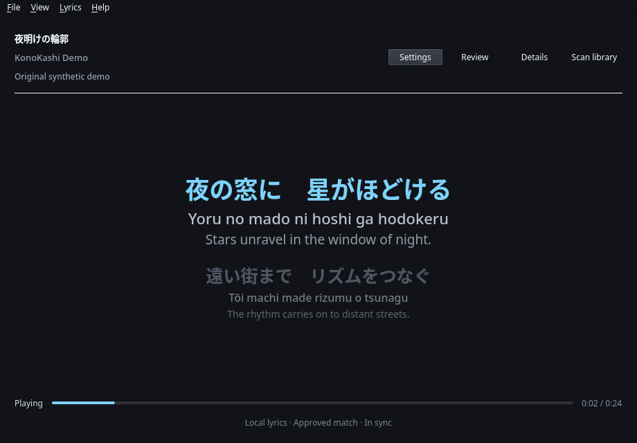

# KonoKashi

**Synchronized, multilingual lyrics for the Linux desktop.**

[](https://github.com/myonctl/KonoKashi/actions/workflows/ci.yml)




_The real desktop renderer, driven by a copyright-safe synthetic lyric fixture._

KonoKashi is a Linux-first desktop app that follows music from players and
browser integrations, looks for a suitable lyric match, and advances timed
lines with playback. Original script stays primary; romanization or
transliteration and translation remain separate, optional layers. The app is
local-first, deeply customizable, and source-available.

## Why KonoKashi?

- **Read the song, not just the transcription.** Keep Japanese, Chinese, Korean,
  and other original scripts visible alongside Latin readings.
- **Follow whatever is playing.** Detect Strawberry and browser playback through
  Linux MPRIS instead of tying lyrics to one music service.
- **Prefer what is yours.** Reuse approved lyrics, local sidecars, embedded
  lyrics, and durable cached matches before making a live provider request.
- **Stay in control.** Review uncertain matches and retain corrections locally;
  low-confidence results are not silently approved.
- **Make it fit your desktop.** Start from a coherent color theme, add local
  album-art context, then tune typography, transparency, spacing, visible
  layers, motion, and progress presentation.

## Features

- **Synchronized lyrics:** timed line changes plus progressive highlighting for
  trustworthy word- or finer-element-timed lyrics, with exact pause, seek, rate,
  and track-change handling; line-only, plain, and instrumental states remain
  explicit.
- **Disciplined native core:** the deterministic playback clock and bounded LRC
  parser use independent narrow C++20 modules, each checked against its retained
  Python reference; matching, providers, storage, and UI remain Python.
- **Multilingual layers:** original text plus aligned romanization or
  transliteration and optional translation, with each active secondary layer's
  identity and provenance visible without displacing the original script.
  Available translations are shown by default and remain independently toggled.
- **Resilient local-first resolution:** sidecar and embedded lyrics,
  provider-isolated SQLite cache and negative cache, offline reuse, and bounded
  parallel lookup across LRCLIB and Unison without accepting the first response.
- **Player-aware matching:** conservative metadata handling for Strawberry and
  KDE Plasma Browser Integration, including duplicate MPRIS entries.
- **Review and repair tools:** choose or reject lyric matches; correct resolved
  title, artists, and album; adjust whole-document timing; maintain local
  per-line translations; and edit original lyric text or individual timestamps
  without replacing provider evidence.
- **Composable controls:** native PySide6 desktop, focused synchronized lyrics
  and settings TUIs, CLI diagnostics, a stable JSONL current-line stream, and one
  canonical TOML configuration.
- **Four desktop modes:** normal window, compact companion, lyric-only desktop
  overlay, and focused fullscreen, all using the same synchronized renderer.
- **Restrained visual identity:** Midnight, Paper, and High Contrast color
  themes plus local MPRIS album art and an optional contrast-guarded background
  tint—without remote theme code, shaders, or a marketplace.

Local reading support covers Japanese and Mandarin with language-aware limits,
Korean romanization, and generic transliteration for Cyrillic, Greek, Arabic,
and Thai.
Generated/provider provenance remains available in Lyrics details rather than
interrupting the listening hierarchy. Romanization is a reading aid, not a
promise of perfect sung pronunciation.

## What the demo shows

The demo advances a local four-line fixture through KonoKashi's real lyric
viewport and smooth-transition system. Each active group contains:

```text
夜の窓に　星がほどける
Yoru no mado ni hoshi ga hodokeru
Stars unravel in the window of night.
```

The title, artist, lyrics, and translation were written specifically for this
demo. No commercial song, audio, playback history, or private user data is
included.

## Try it

KonoKashi supports Linux with Python 3.11 through 3.14; every advertised version
is exercised in CI. **0.1.0-beta.2** is the current public beta. The immutable
0.1.0-beta.1 artifacts remain available as historical release artifacts, but
they do not contain the current application described here.

A desktop session needs a Qt/EGL runtime and session D-Bus. A source install
compiles KonoKashi's narrow playback-clock and LRC-parser modules and, when its
SDK is present, the optional LayerShellQt Wayland surface bridge. It may also
compile PyICU, so install a C++20 compiler, Python and OpenSSL development
headers, ICU development headers, and `pkg-config` when your distribution does
not provide compatible wheels.

For a normal x86-64 Linux desktop, install or replace KonoKashi with the tested
beta.2 Flatpak bundle. Its embedded runtime-repository reference lets Flatpak
obtain the required KDE runtime from Flathub:

```bash
curl --fail --location --output /tmp/KonoKashi-0.1.0-beta.2-x86_64.flatpak \
  https://github.com/myonctl/KonoKashi/releases/download/v0.1.0-beta.2/KonoKashi-0.1.0-beta.2-x86_64.flatpak
flatpak install --user --reinstall \
  /tmp/KonoKashi-0.1.0-beta.2-x86_64.flatpak
```

The release page publishes `SHA256SUMS`; Flatpak also verifies the bundle's OSTree
content while installing it. KonoKashi uses a narrow sandbox: Music is read-only,
MPRIS and KDE's tray watcher are filtered D-Bus destinations, and neither broad
home access nor the unrestricted session bus is granted.

For a source installation, use the exact release tag and the non-sudo bootstrap:

```bash
git clone --branch v0.1.0-beta.2 --depth 1 \
  https://github.com/myonctl/KonoKashi.git
cd KonoKashi
./setup.sh
```

Launch KonoKashi from the application menu, or run:

```bash
.venv/bin/konokashi desktop
```

The helper checks prerequisites before writing, prints an exact Arch/Artix
package command when one is confidently known, never invokes `sudo` or a system
package manager, builds into `.venv`, smoke-tests both native core modules, and
prints the exact launch command. On an interactive terminal it offers the
user-local application launcher; use `--desktop-integration` or
`--no-desktop-integration` to choose explicitly. `./setup.sh --check-only`
changes nothing, and rerunning the normal command refreshes the same environment.

Removing `.venv` leaves your XDG configuration, cache, and lyric database intact.

Then start an MPRIS player such as Strawberry—or play media through KDE Plasma
Browser Integration—and KonoKashi will follow the selected source. The Flatpak
bundle is published directly with this beta rather than through Flathub. The AUR
recipe remains a validated preparation and has not been submitted. See
the [packaging status](https://github.com/myonctl/KonoKashi/blob/main/packaging/README.md)
for validated routes and explicit decisions on later formats.

For a development checkout, see [CONTRIBUTING.md](CONTRIBUTING.md).

## Customize it

Open **Settings** in the desktop app for discoverable controls, or run
`konokashi settings` for the full-screen terminal settings interface. Both edit
the same validated configuration as the CLI and
`$XDG_CONFIG_HOME/konokashi/config.toml`.

Three reviewed color themes and five layout presets provide quick starting
points, while typography, album-art visibility/tint, layer visibility, colors,
background opacity, spacing, alignment, lyric scale, smooth motion, and progress
styling remain independently adjustable. Explicit color choices override a
theme. High Contrast disables artwork tint by default, and all artwork-derived
tints are reduced as needed so they never lower the theme's primary-text
contrast floor. Unavailable fonts fall back through Qt/fontconfig without
replacing the configured choice.

Album art is loaded only from a local `file:` URI supplied by the selected MPRIS
player and accessible to the process or application sandbox. It is decoded off
the UI thread, restricted to PNG/JPEG/WebP, bounded before decode, and reduced
to a 512-pixel RGBA thumbnail. KonoKashi does not fetch remote artwork URLs or
retain the source path in the rendered asset or ordinary
diagnostics. Artwork disappears immediately on source change, and an older slow
decode cannot overwrite the current track.

The **Online lyric sources** setting controls the source order. LRCLIB and
Unison are enabled by default; order is only a tie-break after KonoKashi's own
recording-match evidence, and an empty list disables online lookup. Provider
diagnostics report source, cache/network path, duration, status, and result count
without recording titles, artists, local paths, URLs, or credentials.
Automatic resolution starts enabled providers together. Once the collected
evidence identifies one unique High-confidence recording, KonoKashi allows a
measured 400 ms competition window for another source to agree or conflict; a
conflict removes the deadline and restores full conservative collection.
Irrelevant queued work is then cancelled; already-running requests are detached
so they cannot disrupt a concurrent search and may warm only their provider-query
cache. Frontend generation guards and explicit resolver cancellation prevent a
late response from attaching lyrics to a superseded track. Diagnostics expose
first-viable and final-decision latency as well as each provider's request
duration and cancellation/detachment counts.
It also records first usable-candidate and sufficient-evidence times, while
automatic YouTube and URL-less browser retries report first-pass, metadata or
discovery, retry, and total latency without logging song titles or description
text.
On a cache miss, each enabled source receives only the provider-safe resolved
title, musical artist, and available album/duration—not the local media path,
raw MPRIS URL, player identity, or playback history.

When a confirmed public YouTube video still has no trustworthy lyrics after
that first pass, KonoKashi can automatically request metadata for that one video
using `yt-dlp`. This is enabled by default through **Automatically improve
metadata for web media** (`lyrics.web_media.automatic_metadata`); turn it off to
disable automatic web-media metadata requests. The request uses the video ID and
public metadata only: no audio/video download, browser profile, cookies,
authentication, or playlist traversal. A bounded, sanitized interpretation is
cached locally for three days; the full description is not retained. Offline
mode uses only an existing metadata cache entry, including an expired sanitized
entry when no network refresh is possible. Matching still requires an
independent provider result and does not treat the uploader as the musical
artist.
Some browser MPRIS implementations omit the media URL entirely. For those
session-only sources, a clear artist-first browser title can still drive lyric
search, but the reported browser artist is treated as possible uploader
evidence, not artist truth. Without a video ID, KonoKashi cannot request
video-specific YouTube metadata directly. If an inadequate first pass also has
exactly one bounded channel/uploader label and a usable duration, the enabled
automatic metadata setting permits one fields-only YouTube search of at most
five public videos using the reported title and channel label. This covers both
`Artist - Topic` labels and plain official-artist channel names. KonoKashi
requires one unique exact title/channel-or-uploader match within two seconds of
the browser duration before requesting that video's bounded metadata. It sends
the title and channel label to YouTube for this search, but no browser URL,
cookies, profile, authentication, audio, video, lyrics, or history. The
candidate video ID is only a metadata hint:
the playing source stays session-only, and provider evidence must still decide
whether any lyric is safe to show. A conflicting Topic label also lowers a
dash-split title guess to Low confidence. Other URL-less titles remain
conservative recovery cases, and corrections cannot be remembered for a video
whose ID the browser did not report.
For one unchanged browser track ID, successful discovery hypotheses are reused
from memory for up to ten minutes. A uniquely corroborated discovery is also
cached locally for three days so a later session with the same normalized
title, channel label, and rounded duration can reuse the public video ID and
its sanitized metadata without repeating the search. The durable entry stores
a hashed observation key and the public video ID, not the title, channel,
lyrics, URL, or browser track ID. Ambiguity and failed requests are never
written, and a later successful search that finds multiple exact videos
invalidates the prior mapping. An expired successful entry may be reused only
in offline mode. Cache reuse still supplies recording hypotheses rather than
changing the session-only source identity.
`konokashi lyrics current` uses the same automatic enrichment and retry policy
as the desktop; its bounded preview remains the default for lyric text.
The metadata command requests only the fields needed for interpretation; it
does not retain yt-dlp's large format/subtitle catalogue.
Ambiguous video-title separators can produce at most two extra artist/title
interpretations. Those delimiter-only guesses retain the original MPRIS title
and uploader evidence, are searched at Low identity confidence, and cannot by
themselves authorize an automatic lyric match.
The provider search ladder starts with the strongest interpretation, then tries
each distinct alternative before broader fallbacks, with a 16-step cap. Weak
delimiter-only hypotheses never trigger broad catalogue expansion.
For structured collaborations, one bounded lead-artist lookup also covers lyric
catalogues that omit featured or secondary credits. Retrieval never weakens the
decision: title, version, duration, album, and the complete original artist
credit still determine whether KonoKashi can attach the result automatically.
Common localized YouTube presentation labels such as official video, clip
officiel, video ufficiale, and videoclip oficial are ignored when interpreting
a title, while musical version markers such as live, remix, and radio edit are
preserved. Explicit localized-artist/quoted-title video forms and bounded
decorative `Artist (Title lyrics/letra/testo)` forms are also interpreted
without turning arbitrary parentheses or decoration into recording identity.
Before bounded search, providers can receive exact lookups for up to four
complete, non-weak recording interpretations. When searches remain
insufficient and the source has a usable duration, a bounded album-free exact
ladder also tries the original title and at most one punctuation-normalized
form per strong interpretation. Every response is assessed alongside the
accumulated search evidence; being an exact endpoint response does not by
itself authorize acceptance over conflicting candidates. No album is guessed.
When a local transliterator supplies a phonetic title alias, at most two aliases
are queried before the base-title fallback; the original title remains the
recording identity used for scoring.
Each provider result is evaluated against the bounded recording interpretations,
even when a different interpretation's query retrieved it. The selected
hypothesis, field provenance, and retrieval strategy remain in match evidence;
Low-confidence delimiter guesses still cannot authorize an automatic match.
When structured public metadata independently confirms a delimiter-only guess,
the existing interpretation is promoted with both evidence trails retained.
The automatic retry keeps offline/refresh intent, reuses normal provider-query
cache entries, and never replaces an approved or already successful first pass.
Recording qualifiers are kept intact for matching and timing decisions. Live,
remix, cover, radio edit, remaster year, sped-up/slowed, nightcore, karaoke,
instrumental, and named-language versions are not treated as interchangeable
merely because their base titles and durations agree.
Automatic acceptance evaluates retrieval strength, recording-identity evidence,
lyric-text agreement, and timestamp trust separately. A broad query can still
find a correct recording, but broad retrieval alone never proves the match;
diagnostics explain accepted, rejected, and unresolved competing candidates.
An exact album conflict no longer hides otherwise strongly identified lyric
text: KonoKashi may display the plain text while discarding synchronized
timestamps whose fit to that album/version is not established.
When distinct providers independently return the same normalized plain lyric
text for the same title and artist but disagree on timestamps, KonoKashi may
display the shared text without synchronization. Duplicate records from only
one provider are not independent evidence and remain ambiguous; provider order
or the first result never resolves that conflict.

Open **Review lyrics** from the active lyric view to understand the current
source or repair its match, identity, offset, translation, lyric text, or line
timing. Opening Review does not contact providers; **Find different lyrics** is
a deliberate search, and weak matches remain hidden until explicitly requested.
No alternative is selected or applied automatically. The compact line editor
can stamp each plain lyric line from the current playback position with
`Ctrl+Space`, preview the active corrected line, undo editor changes, and revert
the complete local overlay. Provider and imported source documents stay
unchanged; corrections are stored separately and are ignored safely if their
captured source line no longer matches.

Effective corrected lyrics can also leave the database as portable UTF-8 text:

```bash
konokashi lyrics export current corrected.lrc --format lrc
konokashi lyrics export current corrected.txt --format plain
konokashi lyrics import current corrected.lrc
```

Import requires exactly one aligned line per source line and validates timing
order before replacing the current document's local corrections atomically.
Exports refuse to overwrite a file unless `--force` is supplied. No external
account or contribution service is required.

## Use it from a terminal or another local tool

The focused lyrics TUI uses the same selected player, disciplined MPRIS clock,
timing corrections, local lyric overlays, and multilingual snapshot as the
desktop app:

```bash
konokashi sync current --tui
```

For Waybar, shell scripts, OBS helpers, desktop widgets, and DIY displays, emit
newline-delimited JSON instead:

```bash
konokashi sync current --jsonl --no-pipewire
```

Each stdout line is one compact `io.github.myonctl.konokashi.current-lyrics`
record with `version: 2`. Records contain a monotonic sequence/generation,
current track and playback state, lyric document status/source/provenance,
active line group, trusted generic active segment, a real active word only when
known, next line, media and lyric timestamps, and aligned reading/translation
values. Ordinary interpolated position changes are suppressed; meaningful
track, playback, line, segment, timing, source, and representation changes emit
a new record. The complete field contract and v1 migration note are in the
[current-lyrics schema v2](CURRENT_LYRICS_SCHEMA.md). Diagnostics go to
stderr, and a closed pipe exits without a traceback. The stream intentionally
omits local paths, raw MPRIS URLs, and the stable source identity, but lyric text
and track metadata are expected output and should be treated as private
playback data.

Both terminal modes currently require timed lyrics. They stop with a controlled
error when no selectable player or timed document is available; callers can
restart them under their normal process supervisor. KonoKashi does not start an
HTTP server or listen on a network socket.

Use the visible **View** strip, **View → Window mode**, or `Ctrl+Alt+1` through
`Ctrl+Alt+3` to switch among normal, compact, and floating-lyrics modes; `F11`
opens fullscreen lyrics. `Esc` or the visible fullscreen control returns to the
previous interactive mode. Unlocked floating lyrics have direct drag, opacity,
resize, lock, and exit controls. Click-through is offered only when a system tray
is available, so **Unlock floating lyrics**, screen/mode selection, and **Quit**
remain reachable outside the window.

## Current status

KonoKashi is usable and under active development. **0.1.0-beta.2** is the current
public beta. **0.1.0-beta.1** remains the first public beta and its tag and
artifacts are immutable historical releases.

Linux is the only supported host today. Real-world verification has focused on
Artix Linux with KDE Plasma, Strawberry, and Plasma Browser Integration. Other
standards-compliant MPRIS players may work, but are not all individually
certified.

Translation generation is not implemented. A translation layer contains aligned
provider, imported, local, or user-approved text; KonoKashi does not silently
send lyrics to a machine-translation service. A web frontend, word-level
rich-timing editing, additional rich-timing provider formats, and Windows
support are future work.

Lyrics from [Unison](https://unison.boidu.dev) are used under the ODbL-1.0
public-corpus terms. KonoKashi performs read-only access, retains source
attribution, and does not require a Better Lyrics account. Unison LRC, plain,
and media-clock TTML entries are supported. Timed TTML spans retain start/end
timing and parent identity; explicit word, syllable, and grapheme units stay
distinct, while ambiguous Apple-style spans remain provider elements instead of
being mislabeled as words. Malformed element timing falls back to the containing
line.

Floating lyrics stays a portable movable Qt top-level while unlocked. When
click-through is locked on Wayland, a capability probe selects the native
overlay-layer backend only if both the shipped LayerShellQt bridge and the
compositor's `zwlr_layer_shell_v1` global are available. Other sessions keep the
portable top-most fallback. Native mode has been live-validated on KWin above a
controlled fullscreen client, but this is not an "over everything" claim:
security surfaces, lock screens, privileged shell UI, and peer ordering remain
compositor-controlled. KonoKashi detects background-effect support separately
but does not request or fake blur. See the
[Wayland overlay review](WAYLAND_OVERLAY_REVIEW.md).

## What's next

- Refine the Linux desktop experience through public-beta feedback.
- Refine the correction editor through public-beta feedback and investigate
  word-level rich-timing edits without turning it into a DAW.
- Validate the capability-gated Wayland overlay on more KWin and wlroots
  versions while retaining the honest portable fallback elsewhere.
- Refine terminal lyrics and the stable local event contract through real widget
  and streaming-tool integrations.
- Validate the direct Flatpak bundle on more distributions before considering a
  stable Flathub or AUR submission.

See the concise [backlog](BACKLOG.md) for longer-term direction.

## License

KonoKashi is source-available under the PolyForm Noncommercial License 1.0.0;
read the full [license terms](LICENSE). It may be used, studied, modified, and
redistributed for permitted noncommercial purposes under that license. The
noncommercial restriction means it is **not OSI Open Source**.

## Contributing

Focused bug fixes, tests, documentation improvements, and well-scoped proposals
are welcome. Read [CONTRIBUTING.md](CONTRIBUTING.md) before opening a pull
request.

## Security

Please follow [SECURITY.md](SECURITY.md) for private vulnerability reporting
guidance. Do not post credentials, private paths, playback history, lyrics, or
other sensitive media information in a public issue.
